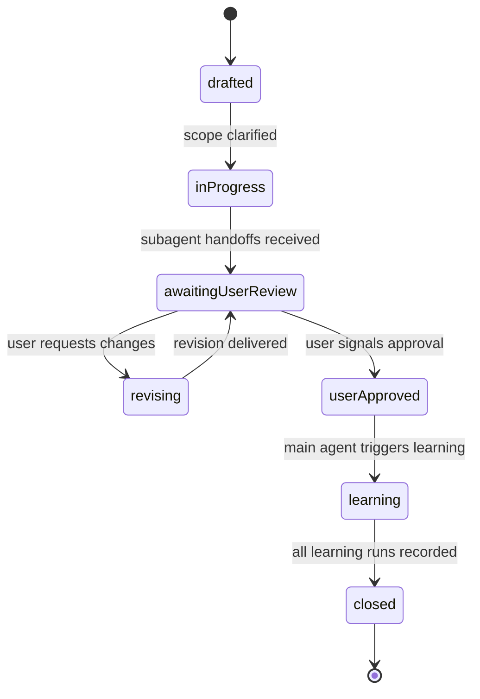

# Task Lifecycle

Defines when a task is considered complete and when the post-task learning routine fires. This file is the single source of truth for the lifecycle. All role files, playbooks, and the main agent reference this.

## States

A task moves through these states in order. State transitions are explicit; agents do not invent new transitions on their own.

1. `drafted`
   - User has stated a desired outcome.
   - Main agent is clarifying scope, acceptance criteria, and routing.
2. `in-progress`
   - Subagents are actively executing role-specific work.
3. `awaiting-user-review`
   - All required role subagents have produced their handoffs.
   - Main agent has summarised the outcome to the user.
   - The task is paused; subagents persist (do not terminate, do not run learning).
4. `revising`
   - User has provided change requests, corrections, or clarifications.
   - Main agent dispatches the relevant subagents to act on the feedback.
   - Each round of revision is captured as evidence for later learning.
   - On completing the revision, the task returns to `awaiting-user-review`.
5. `user-approved`
   - User has explicitly signalled the task is complete to their liking (see "User Approval Signal" below).
   - This is the ONLY state from which learning is allowed to run.
6. `learning`
   - Each participating role subagent runs `learning/learning-routine.md` exactly once.
   - The main agent runs its own learning routine after subagents return their lesson summaries.
7. `closed`
   - All learning runs are complete and recorded in the handoff note.
   - Subagents may now terminate.

## State Diagram

## User Approval Signal

The task only enters `user-approved` when the user explicitly says so. The main agent must NOT infer approval from silence, ambiguity, or partial agreement.

Acceptable approval signals include phrases like:

- "approved", "looks good", "ship it", "done", "complete", "all clear", "task is complete", "good to merge".
- Any direct affirmative reply to a main-agent prompt of the form "Is this task complete to your liking, or should we revise further?".

Acceptable rejection or revision signals include:

- "not quite", "please change X", "redo Y", "this isn't right", or any concrete change request.

If the user's response is ambiguous, the main agent MUST ask one clarifying question and remain in `awaiting-user-review`. It must NOT advance to `user-approved` on a guess.

## Persistence Rules

- Subagents launched for a task MUST stay available between `in-progress` and `learning`. They do not run learning when their direct work finishes.
- The main agent tracks which subagents participated and which are needed for each revision round.
- A subagent that becomes irrelevant for further revision rounds may be released early ONLY if the main agent records that the subagent's role had no further changes for the rest of the task. The released subagent still runs its learning routine when the task reaches `user-approved`, but it does so based on its accumulated context up to its release point.

## Capturing Revisions As Evidence

Every revision round is high-signal data. The main agent maintains a `Revision History` block in the handoff note that records, for each round:

- Which subagent(s) were re-engaged.
- The user's correction or clarification verbatim (sanitized of any sensitive content).
- The change made in response.
- Whether the correction reflected a user preference, a missing requirement, a defect, or a stack convention.

When learning runs, this block is the primary input for high-confidence lessons. A user correction that produced a real code change is treated as `confidence: high` evidence by `learning/learning-validator.md`.

## When Learning Runs

Learning runs ONLY in state `learning`, which is only reachable from `user-approved`. The order is:

1. Main agent announces "task approved, run learning" to each participating subagent.
2. Each subagent runs `learning/learning-routine.md` once with its accumulated context for this task.
3. Each subagent returns a short lesson summary (counts and IDs of approved, quarantined, rejected) plus any conflicts.
4. Main agent runs its own learning routine using the orchestrator-level context.
5. Main agent consolidates all lesson summaries into the handoff `Lessons Captured` section.
6. Task moves to `closed`.

## What Does NOT Trigger Learning

- Subagent finishing its own immediate work.
- Main agent finishing its synthesis to the user.
- User saying "ok" to a clarifying question without approving the whole task.
- The conversation idling without explicit approval.

If the user abandons the task without approval, the main agent MUST NOT run learning. It records "task abandoned, no lessons captured" in the handoff and closes without writing memory.
